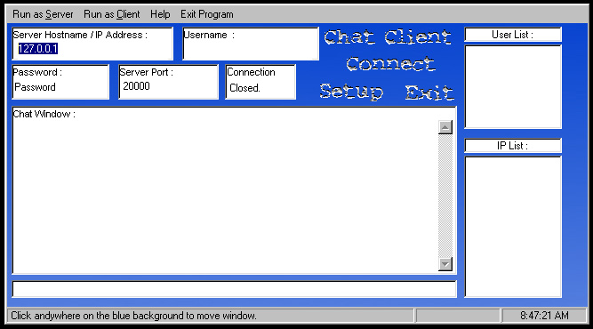



## Communicator \(TCP/IP Chat\)

### Description

TCP?IP Chat program. I found the code here on Planet Source and Changed a bunch of things. I did not get permission from the author so you will have to consider that in using this code. I do not know if the person will mind or not.
 
### More Info
 

             |
---                |---
**Submitted On**   |2000-08-13 08:52:50
**By**             |[Miguel Hidalgo](https://github.com/Planet-Source-Code/PSCIndex/blob/master/ByAuthor/miguel-hidalgo.md)
**Level**          |Intermediate
**User Rating**    |4.7 (14 globes from 3 users)
**Compatibility**  |VB 6\.0
**Category**       |[Complete Applications](https://github.com/Planet-Source-Code/PSCIndex/blob/master/ByCategory/complete-applications__1-27.md)
**World**          |[Visual Basic](https://github.com/Planet-Source-Code/PSCIndex/blob/master/ByWorld/visual-basic.md)
**Archive File**   |[CODE\_UPLOAD89148132000\.zip](https://github.com/Planet-Source-Code/miguel-hidalgo-communicator-tcp-ip-chat__1-10648/archive/master.zip)

